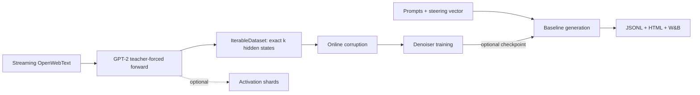

# Архитектура проекта и работа с пайплайном

## Назначение

Проект разделяет streaming-получение данных, обучение denoiser и генеративные
эксперименты. GPT-2 работает в `eval`/`inference_mode`, не обучается и производит
teacher-forced hidden states непосредственно во время обучения. Denoiser —
единственный trainable-модуль и позднее подключается к baseline forward hook.

## Структура

```text
steering-recovery/
├── cache_activations.py       # Hydra-entrypoint сбора hidden states
├── train_denoiser.py          # Hydra-entrypoint обучения
├── run_baselines.py           # Hydra-entrypoint генерации
├── configs/
│   ├── cache_activations.yaml
│   ├── denoiser.yaml
│   ├── baseline.yaml
│   └── experiment/            # готовые параметры multirun
├── steering_recovery/
│   ├── cache.py               # hook и запись .npy shards
│   ├── data.py                # lazy dataset и статистики
│   ├── streaming_data.py      # IterableDataset: OpenWebText → GPT-2 → batches
│   ├── corruption.py          # online-коррупции
│   ├── denoiser.py            # residual MLP
│   ├── training.py            # train/validation/checkpoints
│   ├── intervention.py        # политики steering
│   ├── generation.py          # autoregressive loop с KV-cache
│   ├── baseline.py            # оркестрация baseline
│   └── reporting.py           # JSONL и HTML-отчёт
├── docs/
└── tests/
```

Поток данных:



## Форматы данных

### Streaming teacher-forced dataset

Основной режим — `data.mode=streaming`. Для каждого набора из
`data.streaming.text_batch_size` документов выполняется один causal forward
GPT-2 по настоящей последовательности token IDs. Генерация новых token не
используется: hidden в позиции `t` вычисляется по настоящим токенам вплоть до
позиции `t` включительно.

Из каждого текста берутся все непаддинговые hidden states, кроме самого первого
реального token. Это делается по `attention_mask`, поэтому padding не влияет на
выбор. Однотокенные и пустые тексты не добавляют активаций.

`TeacherForcedActivationIterableDataset` самостоятельно формирует batches:

1. получает очередные тексты из `Skylion007/openwebtext` через
   `load_dataset(..., streaming=True)`;
2. извлекает активации выбранного GPT-2 block;
3. последовательно складывает token states в буфер;
4. выдаёт tensor строго `[k, hidden_size]`, где
   `k = training.batch_size`;
5. переносит остаток к следующему документу; только последний неполный остаток
   всего stream отбрасывается.

Dataset уже выполняет batching, поэтому train loop итерирует его напрямую.
При ручном использовании `DataLoader` допустимы только
`batch_size=None, num_workers=0`: iterator владеет GPT-2 model и не должен
копироваться в worker processes.

Первые `data.streaming.validation_texts` документов выделяются в стабильный
validation stream. Training stream начинается после них и перемешивается
ограниченным буфером `shuffle_buffer_size`; seed меняется с эпохой.

GPT-2 имеет предел контекста 1024. Тексты обрезаются до
`data.streaming.max_length`, и внутри получившейся последовательности
загружаются все states кроме первого.

### Статические активации

Режим `data.mode=static` оставлен для воспроизводимых offline-прогонов.
`data.path` принимает один `.npy`, `.pt`, `.pth` или директорию с shards.
Каждый tensor должен иметь форму `[..., hidden_size]`; все ведущие измерения
считаются независимыми примерами. Для `.pt` допустим tensor либо словарь с ключом
из `data.key` (по умолчанию `activations`). Обычные `.npy` читаются через memory
map.

Опциональный `cache_activations.py` создаёт:

- `activations_00000.npy`, ... — shards;
- `statistics.pt` — `mean` и `std` по координатам;
- `manifest.json` — размерность, число примеров, список shards и полный config;
- `config.yaml` — фактически использованная конфигурация.

### Steering vectors

Один vector: tensor `[hidden_size]` или словарь с `steering_vector`.
Набор направлений для обучения: `[n_vectors, hidden_size]` или словарь с
`steering_vectors`. Слой и hidden size должны совпадать с кешированными
активациями.

### Prompts

Рекомендуемый JSONL:

```json
{"id":"task-001","prompt":"Полный prompt модели"}
```

Остальные поля сохраняются во входном наборе, но baseline использует `id` и
`prompt`. Также поддерживаются JSON-массив и текстовый файл (один prompt в строке).

## Запуск на сервере

Установка:

```bash
conda env create -f environment.yaml
conda activate steering-recovery
```

Для закрытых моделей заранее выполните `huggingface-cli login`. W&B использует
обычный `wandb login`; без сети задайте `wandb.mode=offline`, а для полного
отключения — `wandb.enabled=false`.

Streaming-обучение на GPT-2 layer 6:

```bash
python train_denoiser.py \
  data.mode=streaming \
  data.streaming.dataset_name=Skylion007/openwebtext \
  data.streaming.model_name=gpt2 \
  data.streaming.layer_path=h \
  data.streaming.layer_index=6 \
  data.streaming.max_length=1024 \
  data.streaming.text_batch_size=8 \
  training.batch_size=512 \
  training.max_steps=10000
```

`AutoModel(gpt2)` предоставляет blocks как `h[0] ... h[11]`; поэтому source
dataset использует `layer_path=h`. В causal LM baseline те же blocks находятся
по пути `transformer.h`.

Перед первым optimizer step статистики нормализации оцениваются на
`data.streaming.statistics_batches` streaming batches. Их можно зафиксировать
между запусками, передав готовый `data.statistics_path`.

Статический запуск на ранее сохранённых активациях:

```bash
python train_denoiser.py \
  data.mode=static \
  data.path=/data/activations \
  data.statistics_path=/data/activations/statistics.pt
```

Baseline без вмешательства и с вмешательством:

```bash
python run_baselines.py \
  model.name=/models/llama \
  data.prompts_path=/datasets/prompts.jsonl \
  steering.scale=0 wandb.enabled=false

python run_baselines.py \
  model.name=/models/llama \
  data.prompts_path=/datasets/prompts.jsonl \
  steering.vector.path=/vectors/target.pt \
  steering.layer_index=15 \
  steering.mode=once_at_start steering.scale=1
```

Подключение denoiser в том же прогоне:

```bash
python run_baselines.py \
  model.name=/models/llama \
  data.prompts_path=/datasets/prompts.jsonl \
  steering.vector.path=/vectors/target.pt steering.scale=1 \
  denoiser.enabled=true denoiser.checkpoint=/runs/denoiser/best.pt
```

Режимы вмешательства:

- `none` — hook установлен, но активации не меняются;
- `once_at_start` — vector добавляется один раз на prefill;
- `every_step` — vector добавляется на каждом forward;
- `entropy_threshold` — vector добавляется, если нормализованная token entropy
  предыдущего шага не меньше порога. Это причинная политика с KV-cache; prefill
  не изменяется, а первая возможная интервенция происходит на следующем forward.

Baseline сохраняет `generations.jsonl`, `metrics.jsonl`, `report.html` и полный
`config.yaml`. Основные агрегаты: длина, средняя нормализованная entropy и доля
forward-вызовов с интервенцией. Семантический judge намеренно не зашит в проект:
его ответы можно объединять с `generations.jsonl`, не смешивая генерацию с
конкретным внешним API.

## Воспроизводимость и Hydra

Одиночный override:

```bash
python run_baselines.py steering.scale=10 generation.seed=123
```

Grid по режиму, scale и порогу:

```bash
python run_baselines.py -m \
  steering.mode=once_at_start,entropy_threshold \
  steering.scale=0,1,10 \
  steering.entropy_threshold=0.25,0.35,0.45
```

Каждый job получает отдельную директорию Hydra. В config результата записаны все
override, seed и пути к артефактам.
